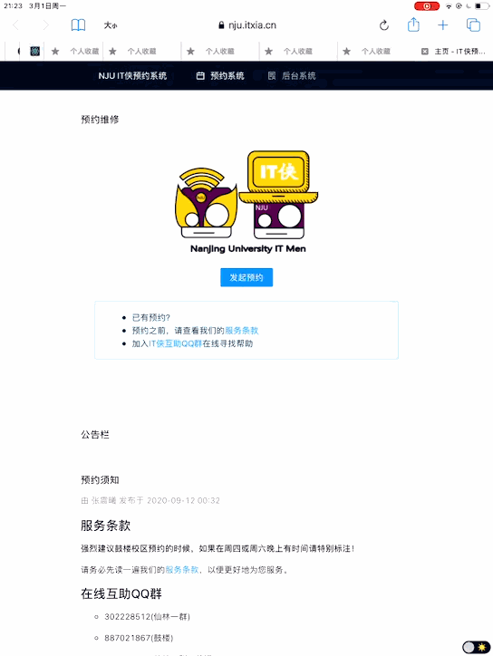
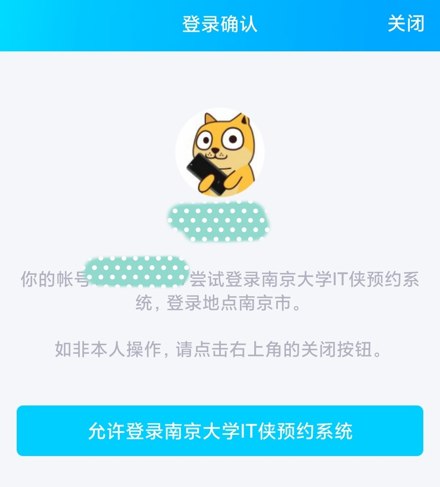
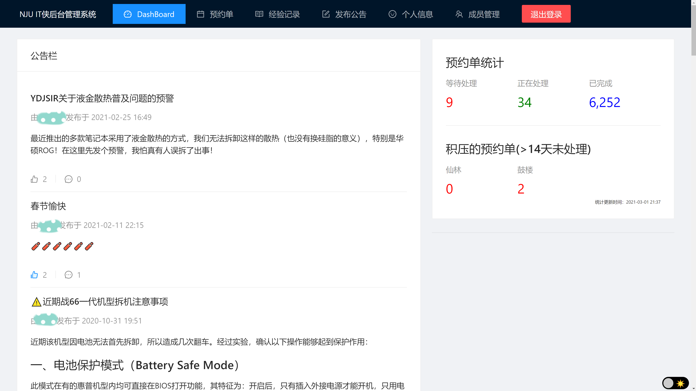
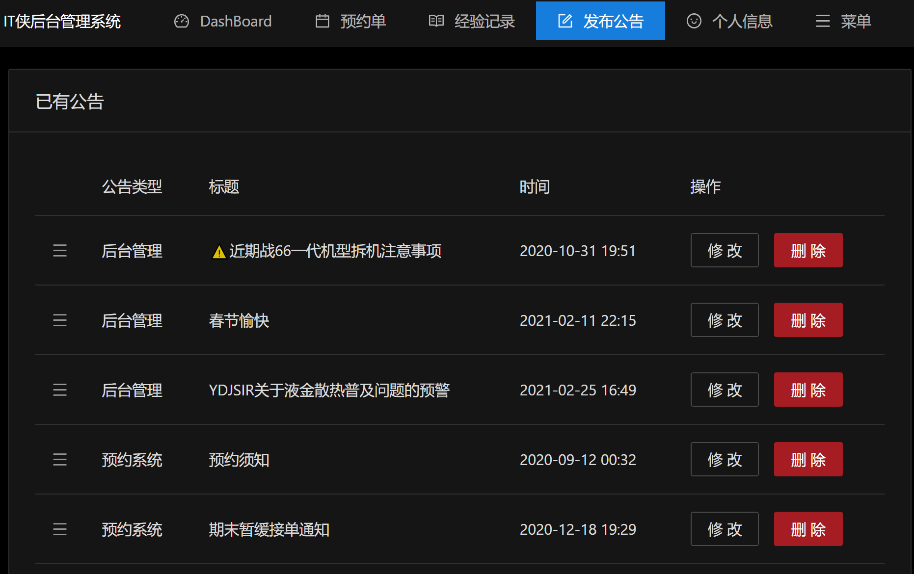
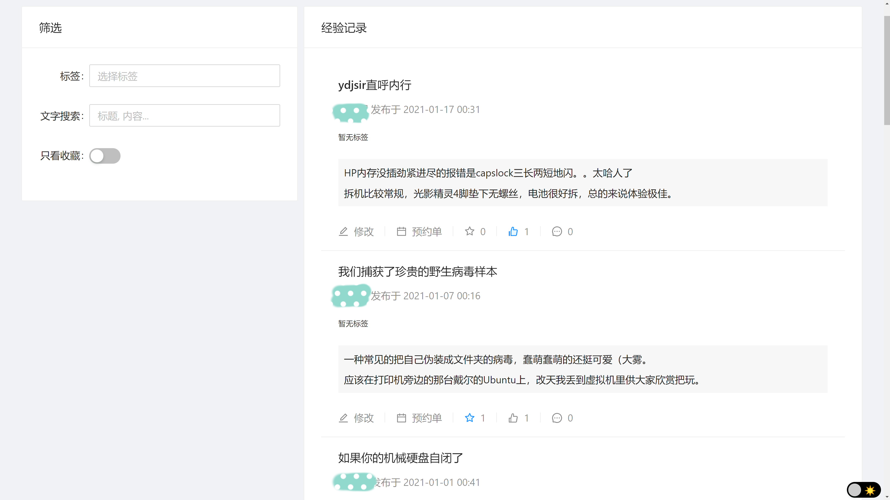
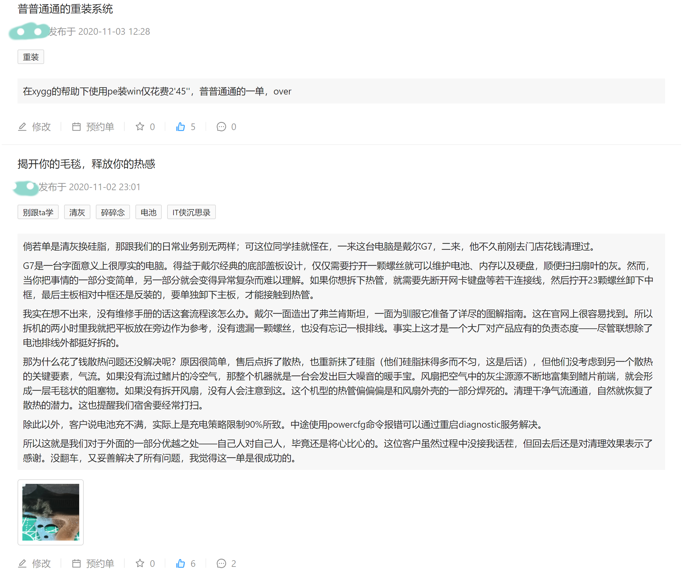
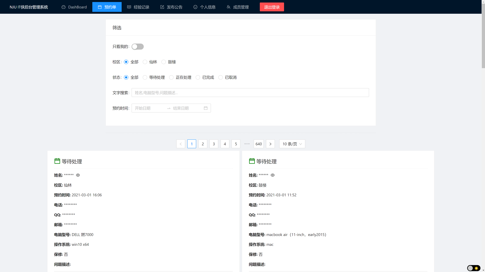
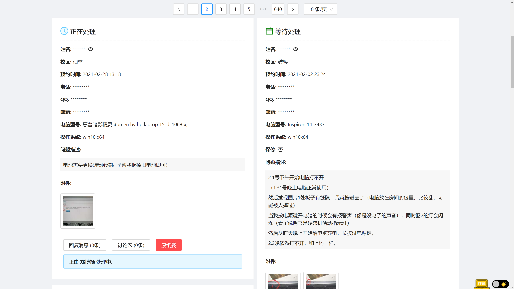

# Features
一些人性化、有趣的细节.

## 返回顶部小火箭
自行设计实现了好玩的BackTop组件。

技术实现：
- 设计四种状态：隐藏、显示、淡入、淡出。
- 监听scroll事件，高度超过阈值时淡入显示BackTop组件。
- 不同状态（以及之间的切换）对应不同的位置、透明度。
- 点击后通过设置页面scrollTop属性、组件bottom属性实现返回顶部动画。(raf)

## 暗黑模式
可以点击右下角切换暗黑模式，夜间更护眼。

同时支持iOS设备的深色模式。

实现原理：
- 适配Ant Design的Dark Theme。
- 私有组件通过设置CSS class来切换颜色和样式。
- 使用Media Query(prefers-color-scheme)实现iOS系统深色模式适配。(Windows自带浏览器仍不支持该特性，但能在开发者控制台调试)

## 通过QQ登录

不用再记密码了~

实现原理：
- 前端将页面重定向到QQ授权页面。
- QQ授权页面授权成功后，重定向到预约系统OAuth页面，并带上token。
- 返回token到后端，向QQ服务器API进行校验。
- 若校验通过，返回登录状态cookie并重定向到主页。

## Dashboard 页面
登录进入后的主页，展示最近信息。

## 可拖动的公告排序
相比设置置顶/优先级，我认为拖动排序更**人性化、易用**。

实现原理：
- 集成、适配react-sortable-hoc。
- 调整后端API适配排序。

## 经验记录页

完成预约单后，可以在此填写经验记录，供大家查看、分享经验。

~~你甚至还能看到维修文学~~

其它特性：
- 支持标签/文字搜索、收藏。
- 评论区讨论。

## 按钮去哪了？

仔细观察会发现，所有的搜索都没有“搜索”按钮。

为什么还要多点一下按钮呢？你只需要改变搜索条件即可。

实现原理：
- 监听Form表单值变化。
- 使用debounce避免频繁触发。

## 隐私保护

预约系统不会收集任何不必要信息，亦没有引入第三方统计、广告服务等等。

此外，预约单默认不显示个人信息，避免不必要的隐私泄露（如截图等）。

## 安全性

在此之前，旧系统仍然使用IP登录，甚至密码存储也是明文存储。

都2020年了，这当然是无法让人接受的。

新系统使用加密密码，并且全站配置了HTTPS + HSTS。

实现原理：
- 后端使用bcrypt算法加密密码。
- 服务器配置Let's Encrypt的HTTPS证书。
- 设置Strict-Transport-Security header实现HSTS。
- Cookie设置Secure, Http Only, Samesite strict 保证安全。

## 响应式设计

根据设备的尺寸分辨率，调整显示内容。

当你用电脑查看预约单，能同时看两列，而手机上只有一列。

实现原理：
- Media Query(min-width)。
- Ant Design自带的layout属性。
- 使用Flex容器实现可伸缩组件。